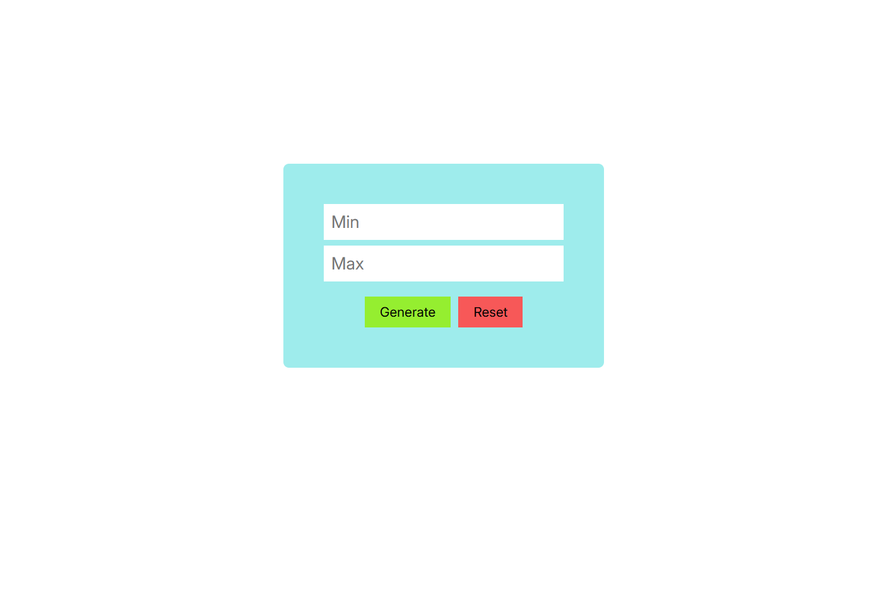
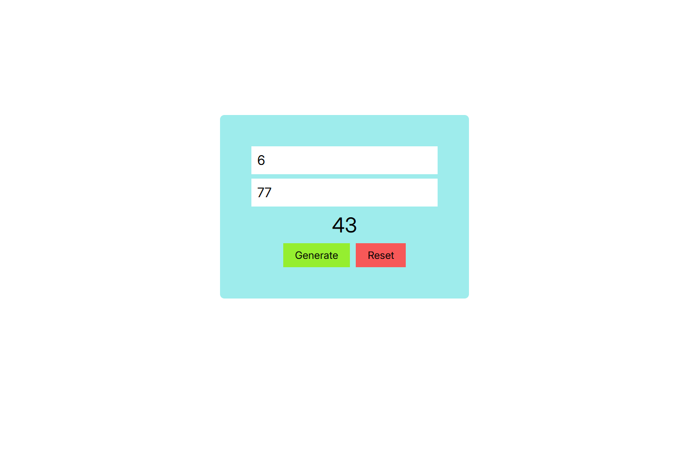

В этом проекте вы можете сгенерировать случайное число (конечний диапозон включен).

Также в этом проекте есть обработки ошибок:
1. Если одно из чисел не введено, то будет подсказка: 'Введите числа'.
2. Если минимальное число больше максимального, то будет подсказка: 'Минимальное число больше максимального'.

## Скриншоты

